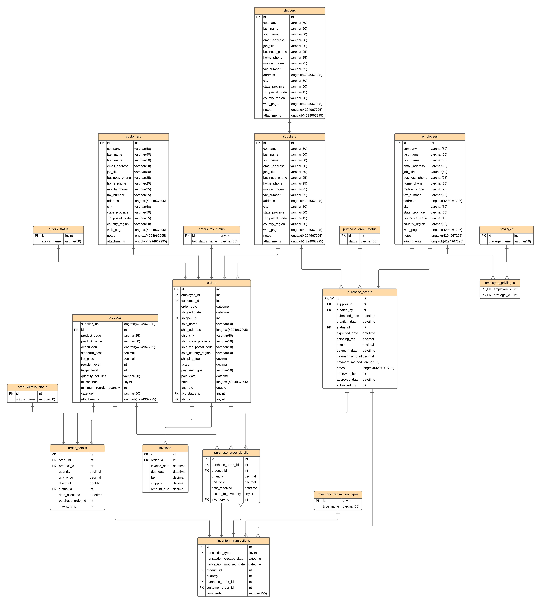

# Analytics Engineering Bootcamp - dbt Project

## Hands-on Project: Modernizing Northwind Traders' Data Architecture

### Introduction
The Northwind Traders Database (OLTP) is a fictitious specialty foods export-import company's sample database created by Microsoft. The current architecture of Northwind is a mix of on-premise and legacy systems, primarily relying on a MySQL database for all sales transactions, reporting, and analytical solutions.

### Problem Statement
The company struggles to meet reporting requirements, causing the operational database to slow down and impact day-to-day operations. They aim to gradually shift away from on-premise solutions to modernize their data and reporting solutions.

### Objectives
- Improve scalability.
- Reduce load on operational systems, especially on the OLTP systems.
- Provide better access controls over data.

### Proposed Solution
- Migrate the existing on-prem MySQL system to Google Cloud's fully managed Cloud SQL for MySQL.
- Set up an OLAP system for reports using Google BigQuery.
- Develop a dimensional data warehouse on BigQuery to support reporting requirements.

### Project Workflow

#### Requirement Gathering
1. **Define Business Processes** using Kimball's Lifecycle:
   - Sales Overview
   - Sales Agent Tracking
   - Product Inventory Management
   - Customer Reporting
2. **Data Profiling**: Understand the intricacies and issues of the current data. For example, discrepancies in the `customer` table records.
3. **Identify Needed Tables**: Customers, Employees, Orders/Details, Inventory Transactions, Products, Shippers, Suppliers, Invoices, etc.

#### Data Architecture and Modeling
1. **Conceptual Model**: Design a high-level data model.
2. **Data Flow Diagram Level 0**: Depict the flow of data through the system.
3. **Dimensional Modeling**: Follow the four steps - Select the business process, Declare the grain, Identify the dimensions, Identify the facts.
4. **Logical Modeling**: Including Entity Relationship Diagrams (ERDs).
5. **Physical Design and Development**:
   - Create Physical Model
   - Source to Target Document
   - Setup Data Warehouse using dbt
   - Create and populate tables using SQL

### Migration Strategy
- Migrated on-prem MySQL data to Google Cloud SQL.
- Data is then loaded into a BigQuery Data Lake layer, replicating the original MySQL OLTP data sources.
- Introduced a staging layer for transformations and data cleansing.
- Built dimension and fact layers followed by an OBT for optimized reporting.

 **Northwind OLTP ERD**:
  

### Directory Structure

- `models/`: Contains all the dbt models.
  - `staging/`: Contains the staging layer models which are the first transformation of the source data.
  - `warehouse/`: Contains the dimensional and fact tables for the data warehouse layer.

- `tests/`: Contains custom data tests.

- `macros/`: Contains custom macros used across the project.

## Data Sources

- **Northwind**: A sample database representing a company's sales operations.

## Setup & Running

1. Ensure you have dbt installed.
2. Clone this repository.
3. Navigate to the project directory.
4. Run `dbt debug` to ensure your connection is set up correctly.
5. Run `dbt run` to execute the models.

## Models

### Staging Layer

- `stg_customer`: Staging table for customer data.
- `stg_employees`: Staging table for employee data.
- ... 

### Data Warehouse Layer (Dimensional Modeling Layer)

- `dim_customer`: Dimension table for customer data.
- `dim_employee`: Dimension table for employee data.
- ...

  ## Entity Relationship Diagrams (ERDs)

Here are the Entity Relationship Diagrams for the different models:

- **Conceptual ERD**:
  

- **Logical ERD**:
  

- **Physical ERD**:
  

